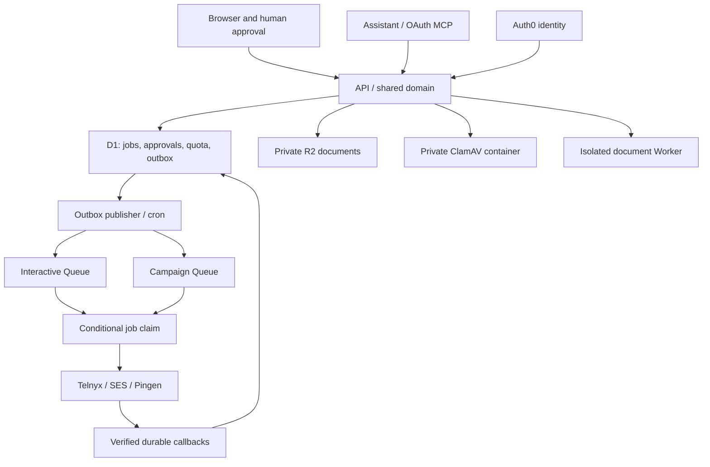

# Architecture

One TypeScript application, React/Vite assets and Hono API with shared domain operations; stateless official MCP v2 handler. Dedicated document Worker isolates browser processing. D1 owns authorization-related membership and all business commitments. R2 contains exact immutable private bytes. Since the controlled domain switch on 17 September 2026, the production-mode application serves `https://guteneo.com`, backed by EU-jurisdiction D1/R2, queues, a private ClamAV container and the private document Worker. Auth0 is configured; a completed signup and browser session still require qualification, and live communications remain disabled. The same backend is reachable at `https://guteneo-app.nclsppr.workers.dev`, but browser login must start on the canonical domain to retain its host-only callback cookie. The separate public design preview at `https://guteneo-preview.nclsppr.workers.dev` serves browser-local examples, with only static assets and no access to the application backend. See [LIVE_RELEASE.md](LIVE_RELEASE.md) for dated release proof.

A queued transition is a D1 write whose SQL trigger verifies approval, reserves quota and writes outbox. Queue publication may duplicate and is repaired by cron. A conditional claim creates one attempt. Expired submitting leases become unknown, not queued. Successful supplier acceptance and delivery are separate facts. In fax v3, financial settlement is a third fact: terminal delivery alone retains the approved reservation. A qualified usage proof tied to the exact tenant, quote, attempt, provider reference and current administrator records immutable private supplier costs, applies the firm customer cap, accumulates fractional consumption and releases the remaining reserve atomically. No public API or assistant can submit that proof; automated Telnyx cost-record correlation is not yet qualified. A complaint after delivery remains representable. Cancellation stops queued/prepared work only; already attempted sends require provider-specific reconciliation.

Approvals bind fingerprint of normalized recipient, immutable document ID/hash, sanitized final HTML/text, sender, options, estimated cost and ceiling. No MCP approval tool exists. Content changes create a new command. Campaign membership freezes when approved; current bounded campaign import prepares individual recipients and requires individual approvals. Large asynchronous manifest materialization is a future extension, not claimed delivered.

## Runtime and location

D1 migrations 0001–0022 are applied remotely. Migration 0023 and the fax usage model are a local candidate pending integrated verification and release; no active tariff is installed. The canonical domain belongs to the application Worker; the preview has no custom-domain route. Public static pages pass through host-aware response policy: only canonical public documents and images are indexable, while alternative hosts, account/API/auth routes and private query parameters retain noindex. `robots.txt` follows the same origin policy. Public asset access does not bypass authentication on private routes.

D1 and R2 provisioning plans require EU **jurisdiction**, not merely a location hint. Binding R2 also declares `jurisdiction: eu`. This says nothing about all Workers execution, Browser Run processing, Auth0 tenant, email routing, Telnyx/Pingen subprocessors, logs or backups. Those locations and contracts require qualification before live data. Originals never become public assets.

## Evolution threshold

D1 paid database limit verified at 10GB; operational alert at 5GB, migration planning at 7GB. Monitor p95 persisted acceptance >2s for 15 minutes, D1 overloaded errors >0.1%, oldest outbox >60s, uncertainty count >0, and callback projection p95 >10s. These are initial engineering thresholds, not measured SLO claims. Bounded indexed scans, pagination and per-organization limits come first. PostgreSQL migration would preserve command IDs, immutable manifests and unique constraints, translating acceptance SQL triggers into transactions; no second backend is built now.

## Deliberate first-release limitations

Real sends remain gated by verified live estimates and external configuration. Deterministic simulation traverses actual D1/Queues/domain paths. The local PDF browser is a development substitute; separate real Cloudflare Browser Run byte/render evidence is recorded in SCANNER.md. Scanner definitions require refresh at least every 72 hours and currently need an operational daily rebuild/redeploy procedure. Marketing is disabled until real unsubscribe policy/event handling are qualified. Platform content-operator access is not implemented; there is no universal operator bypass. No Workflow, KV, custom OAuth server, LLM call or VBS dependency.
