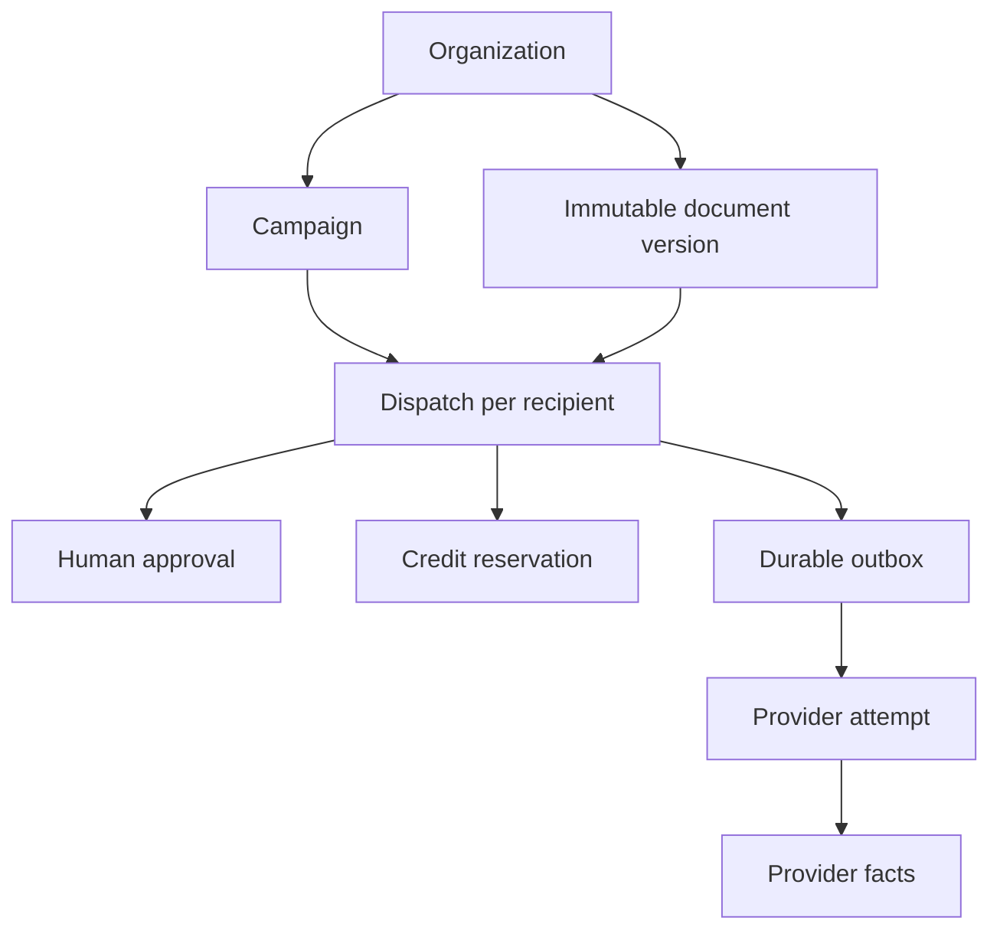

# Business data, approval and reliability

Implementation: `packages/domain/src/index.ts`, `migrations/0001_core.sql`, `migrations/0004_core_hardening.sql`, `migrations/0008_document_versions.sql`. Authentication migrations are separate. All timestamps use ISO-8601 UTC. Transport results and simulation results belong to different organization modes; an organization cannot run through a domain service with another mode.

## Ownership and records

| Records                                 | Purpose and constraints                                                                                                                                                                                                                                                                      |
| --------------------------------------- | -------------------------------------------------------------------------------------------------------------------------------------------------------------------------------------------------------------------------------------------------------------------------------------------- |
| `organizations`, `users`, `memberships` | Membership resolves tenant and role. Domain checks membership and role against the database even when the caller provides a trusted context.                                                                                                                                                 |
| `documents`                             | One retained PDF version per organization/hash; purged historical versions remain separate immutable records. Original R2 key, byte hash, size and source cannot change. No global deduplication/existence disclosure. A quarantined, unparsed upload has `pages=0`; production promotion requires a trusted scanner result plus isolated PDF validation. |
| `senders`                               | Verified channel-specific sender. Identity/address, tenant, mode and channel cannot change. Revocation changes status. Every dispatch also freezes `sender_address`.                                                                                                                         |
| `campaigns`                             | Named draft group, maximum 500 dispatches. First human approval freezes membership. Its manifest hash binds the ordered dispatch IDs/fingerprints.                                                                                                                                           |
| `dispatches`                            | One recipient, one channel, one immutable preparation. Composite tenant/document/sender/campaign foreign keys prevent cross-tenant relations. Content, recipients, options, ceiling, sender snapshot and mode are immutable in SQL.                                                          |
| `approvals`                             | Authenticated browser human approval, user, preparation fingerprint, expiry (15 minutes). MCP callers cannot approve. Revoked/expired approval never reserves a quota.                                                                                                                       |
| `idempotency_keys`                      | Unique tenant/operation/key with request hash and resource ID. Reusing a key for another content or dispatch conflicts. Preparation has its own tenant-scoped unique key on `dispatches`.                                                                                                    |
| `usage`, `reservations`                 | Integer EUR minor units; counts and ceilings are separately reserved/confirmed/released. Shared monthly quota bounds are enforced inside the same SQLite mutation as acceptance.                                                                                                             |
| `outbox`                                | One durable queue publication intent per dispatch. Inserted by the acceptance trigger, in the same atomic write as status and reservation.                                                                                                                                                   |
| `attempts`                              | Remote submission started/accepted/rejected/unknown, remote ID if known and machine error code. A lease is not permission to resubmit.                                                                                                                                                       |
| `provider_events`                       | Unique provider/event ID, original normalized fact payload, occurrence/receipt times, optional eventual dispatch assignment. Orphans persist until correlation. The HTTP entry point verifies the original signed callback before invoking this service.                                     |
| `suppressions`                          | Tenant/email block for unsubscribe, provider permanent bounce or complaint. A transient SES bounce is visible but does not permanently suppress the address.                                                                                                                                 |
| `audit_log`, `channel_controls`         | Human approval/cancellation, scan promotions and provider-reference conflicts; tenant/channel emergency disable. This audit is separate from technical logging.                                                                                                                              |

## Document versions and retention

The partial unique index in migration 0008 deduplicates `(organization_id, sha256)` only while a document is not purged. Re-importing identical bytes after a purge creates a new document ID, creation date and R2 object key. The old record stays purged, and SQL forbids restoring its status. Historical dispatches and their approval fingerprints retain their original document reference; importing the same content never revives an old approval.

Each new registration candidate has a distinct R2 key containing its version ID. Concurrent imports of the same retained content resolve to one database record. A losing candidate deletes only its own unused object. Cleanup failure leaves an orphan for the existing bounded maintenance pass after 24 hours. An uncertain database response leaves the object intact, because registration may already have committed. An interrupted purge can therefore resume deleting its old key without deleting a newer import.

Migration 0008 preserves existing document IDs and composite tenant foreign keys, reinstates the document-readiness triggers, and checks foreign-key integrity before completing the table replacement. A populated migration fixture proves preserved dispatch, approval, reservation and outbox records in local Miniflare D1. This is not evidence of a remote migration execution.

## Acceptance and queue semantics

1. Prepare sanitizes final HTML, normalizes recipient and sender, checks the document, and hashes the immutable payload. This operation spends no transport credit.
2. A browser approval binds the displayed fingerprint. A model-supplied boolean never creates approval.
3. Confirm inserts/validates its idempotency claim and conditionally changes `prepared → queued` in one D1 batch. SQL triggers recheck document/sender/suppression/channel, require unexpired matching approval, reserve the ceiling and insert outbox. Any failure rolls the whole batch back.
4. Outbox publication is awaited before its published flag. A crash may publish twice, which is safe: the consumer atomically claims `queued → submitting` with a unique attempt token. Up to five oldest pending rows per organization are selected per bounded publisher pass, preventing one organization from occupying the entire batch.
5. Only the winning attempt invokes the connector. It rechecks sender/document revocation, recipient suppression and emergency stop immediately beforehand.
6. An explicit no-acceptance rejection releases reservation. A thrown request or ambiguous response moves to `submission_unknown` and retains the reservation. Known remote IDs from uncertain responses persist and can correlate callbacks. Expired processing leases become unknown; they never create another provider call.
7. Verified facts are monotonic and channel-aware. They reconcile orphans and convert reservation to confirmed consumption. Conflicting provider references cannot overwrite an already bound reference; they produce an audited discrepancy. Duplicate and reordered events do not regress delivered/complained results.

This is **at-most-one automatic submission attempt per business command**, with explicit uncertainty after failures; it is not a claim of exactly-once physical delivery. An intentionally authorized resend must be a new command. There is currently no unsafe retry button or automatic channel/provider fallback.

## Cost accounting semantics

Simulation values (fax 20 test cents/page, email 1, post 150) are illustrative test credits, **not provider rates or commercial prices**. Production preparation fails closed with `LIVE_PRICING_REQUIRED` until a real account/destination quote resolver and spending authorization are connected. `known_minor` is independent and remains null when there is no verified provider cost.

The initial ledger conservatively confirms the reserved ceiling after provider acceptance; it does not bill the client or imply that the supplier charged that exact amount. Final known-cost settlement, currency conversion and charging/refunds are deferred. An unknown outcome never frees the ceiling. Production onboarding receives zero limits and disabled channels; there is no automatic monthly funded entitlement.

## Campaign scope and pagination

The implemented workflow is bounded preparation of up to 500 dispatches with a shared document, then explicit approval/confirmation **per dispatch**. A frozen campaign cannot acquire another recipient, and every dispatch has an independent status. SQL enforces the size bound under concurrency. List endpoints use a stable `(created_at,id)` cursor and maximum page size 100; they never return document bytes.

Bulk manifest acceptance and asynchronous materialization of campaigns above 500 recipients are deliberately **not implemented**. The UI/API reject larger CSV input instead of pretending to support an unbounded batch or weakening approval. A future extension must reserve the manifest durably, materialize idempotent chunks and bind a single campaign authorization to its exact manifest and total ceiling.

## Tests and measured scope

`npx vitest run tests/integration/domain-invariants.test.ts` runs the SQL in actual local Cloudflare Miniflare D1. The tests exercise concurrent quota/confirmation, duplicate queue delivery, failed outbox publish, unknown remote outcome, early/orphan/duplicate/reordered facts, provider-reference conflict, immutable fields, isolated organizations, suppression, sender/document revocation, quarantined upload promotion and approval expiry.

`tests/integration/documents.test.ts` additionally verifies exact R2 bytes after completed and interrupted purges, concurrent tenant-scoped re-import, preservation of historical approvals, uncertain registration, failed candidate cleanup, and the populated 0007-to-0008 schema upgrade.

No test here sends email, fax or physical post. Provider HTTP signatures and concrete connector contracts are tested in their own suites. No real client authorization flow, provider account or hosted D1 performance is inferred from local tests.

## Growth and migration boundaries

Indexes cover tenant pagination, campaign membership, expired submission leases, pending outbox, provider remote IDs, orphans, attempts and audit. JSON payloads hold immutable options/content metadata; relational identifiers and critical predicates remain normal columns/constraints.

Operational review thresholds: investigate when database size reaches 60% of the verified D1 cap, callback/outbox lag exceeds its target, or measured acceptance p95 exceeds 2 seconds under the intended load. Approaching 80% is a migration/provisioning gate, not a promise that one database can absorb all tenants. The verified numerical D1 limits and account quotas belong in `VERIFICATION.md`; local tests do not establish production throughput.

A PostgreSQL move can preserve tenant IDs, immutable fingerprints, outbox and reservation model, while porting SQLite trigger syntax and conditional updates. No second backend is maintained prematurely. Large event/audit payload retention, independent encrypted backups and restored-command reconciliation are operational requirements; restoring a database must pause consumers and compare restored pending commands with provider facts before any release.
