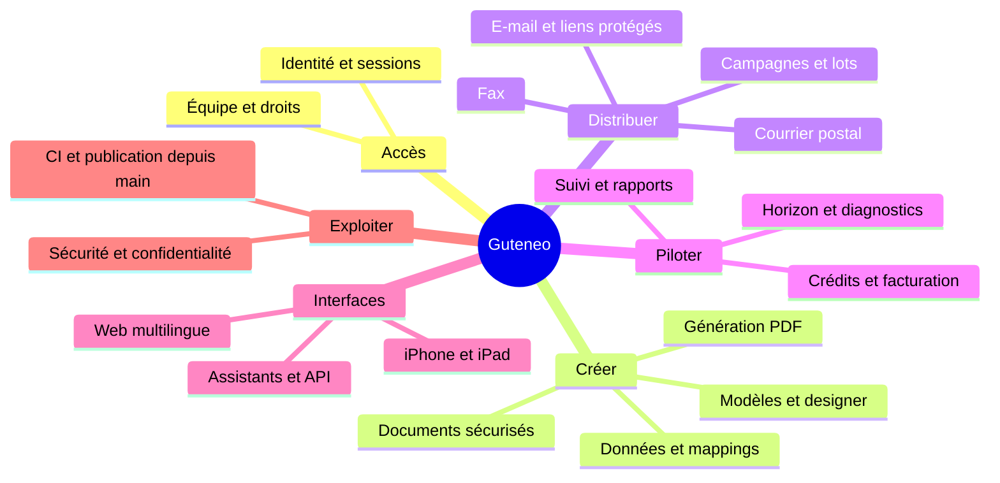

<!-- Generated from feature-map.json by node docs/build-feature-map.mjs -->
# Guteneo · atlas technique

> **16 domaines · 118 fonctionnalités · 15 parcours** — mis à jour le 2026-10-03.
> Documentation du dépôt uniquement. Implémentation ≠ activation ≠ preuve de publication.

Vue visuelle hors ligne : ouvrir [FEATURE_MAP.html](FEATURE_MAP.html) dans un navigateur. Source éditable : [feature-map.json](feature-map.json). Régénérer avec `node docs/build-feature-map.mjs`.

## Vue d’ensemble

## Droits en un coup d’œil

Le contrat définit quatre rôles humains. La cinquième colonne décrit l’assistant connecté, un acteur OAuth, sans ajouter de rôle de membership.

| Capacité | Administrateur | Superviseur | Opérateur | Observateur | Assistant connecté |
| --- | --- | --- | --- | --- | --- |
| Lire contenus accessibles | Oui | Oui | Oui | Oui | Selon membre + scopes |
| Importer / préparer | Oui | Oui | Oui | Non | Selon membre + scopes |
| Approuver / confirmer / annuler | Oui | Option Approbation | Non | Non | Mandat expert distinct uniquement |
| Rapports agrégés | Oui | Option Rapports | Non | Non | Selon membre + scopes |
| Gérer atelier / membres | Oui | Non | Non | Non | Non |
| Gérer facturation / souscrire Horizon | Navigateur | Non | Non | Non | Non |
| Accorder / renouveler mandat expert | Navigateur | Non | Non | Non | Non |
| Modifier modèle partagé | Droits sur ressource | Droits sur ressource | Droits sur ressource | Non | Membre + scopes + ressource |
| Supprimer modèle | Propriétaire | Propriétaire | Propriétaire | Non | Propriétaire + scopes |
| Voir PDF généré privé | Créateur seulement | Créateur seulement | Créateur seulement | Selon accès autorisé | Selon propriétaire et contexte |
| Profil / langue / ses sessions | Personnel | Personnel | Personnel | Personnel | Pas d’administration navigateur |

Les deux options du superviseur sont indépendantes et fermées par défaut. Le rôle appartient à un atelier ; changer de rôle révoque les accès et les approbations encore en attente. Les scopes OAuth n’élèvent jamais les droits. La lecture de l’atelier n’ouvre pas les données ou PDF privés d’un autre créateur. Une demande liée peut donner une revue bornée aux approbateurs actuels ; elle n’ouvre pas la bibliothèque privée. Voir [le contrat des rôles](WORKSPACE_ROLES.md) et [le contrat du studio](TEMPLATES_DATA_DISTRIBUTION.md).

## Arbre exhaustif des fonctionnalités

### 01 · Accès et identité

**État :** Implémenté · disponibilité à vérifier.

Contrat : [IDENTITY_MCP.md](IDENTITY_MCP.md) · Source : [apps/api/src/auth.ts](../apps/api/src/auth.ts).

**Surfaces :** Navigateur authentifié. **Tests :** [tests/unit/auth.test.ts](../tests/unit/auth.test.ts).

- Connexion Auth0, compte vérifié et politique MFA
- Création d’atelier et administrateur initial
- Profil personnel et préférence de langue
- Sessions web : consultation, révocation et déconnexion
- Changement d’atelier avec droits courants
- Connexions OAuth : rattachement, révocation et scopes
- Demande de suppression du compte ; traitement complet restant à qualifier

### 02 · Équipe et responsabilités

**État :** Implémenté · disponibilité à vérifier.

Contrat : [WORKSPACE_ROLES.md](WORKSPACE_ROLES.md) · Source : [packages/contracts/src/roles.ts](../packages/contracts/src/roles.ts).

**Surfaces :** Navigateur authentifié. **Tests :** [tests/integration/workspace-roles.test.ts](../tests/integration/workspace-roles.test.ts).

- Quatre rôles humains et options indépendantes du superviseur
- Gestion des membres, changement de droits et révocation atomique
- Protection du dernier administrateur
- Invitation individuelle ou CSV ; aperçu et confirmation du lot
- Acceptation à adresse vérifiée, expiration et révocation des invitations

### 03 · Documents et sécurité

**État :** Implémenté · disponibilité à vérifier.

Contrat : [SCANNER_RESCAN.md](SCANNER_RESCAN.md) · Source : [apps/api/src/documents.ts](../apps/api/src/documents.ts).

**Surfaces :** Web / REST / MCP. **Tests :** [tests/integration/documents.test.ts](../tests/integration/documents.test.ts).

- Dépôt PDF et import distant borné
- Recherche, liste paginée, lecture des métadonnées et pages
- Quarantaine, antivirus réel, empreinte et validation PDF
- Reprise d’analyse du même document, sans réimport
- Préchauffage scanner par administrateur navigateur
- Rendu HTML en PDF isolé et document immuable
- Stockage privé, quotas, rétention et confidentialité par propriétaire

### 04 · Studio de modèles

**État :** Implémenté · disponibilité à vérifier.

Contrat : [TEMPLATES_DATA_DISTRIBUTION.md](TEMPLATES_DATA_DISTRIBUTION.md) · Source : [apps/api/src/template-workflow.ts](../apps/api/src/template-workflow.ts).

**Surfaces :** Web / REST / MCP. **Tests :** [tests/unit/template-authoring.test.ts](../tests/unit/template-authoring.test.ts).

- Bibliothèque privée, partagée ou organisation
- Cinq exemples : lettre, facture, relevé, devis, livraison
- Copie privée ou création vierge ; guide de création REST/MCP
- Import Word DOCX et avertissements
- Designer : variables, tableaux, colonnes, logo, formats et conditions
- Schéma métier, jeux d’essai, calculs et totaux
- Suggestions IA revues puis appliquées explicitement
- Aperçu PDF exact, versions, publication, duplication et archivage
- Partage : utilisation, édition, publication et partage indépendants
- Suppression par propriétaire ; conservation des PDF et de la provenance

### 05 · Données et mappings

**État :** Implémenté · disponibilité à vérifier.

Contrat : [DATA_IMPORT.md](DATA_IMPORT.md) · Source : [apps/api/src/template-workflow.ts](../apps/api/src/template-workflow.ts).

**Surfaces :** Web / REST / MCP. **Tests :** [tests/unit/datasets.test.ts](../tests/unit/datasets.test.ts).

- Import CSV, XLSX, XML et JSON ; original privé
- Choix des feuilles, en-têtes ou chemin de records XML
- Profilage, anomalies et lecture paginée
- Reprise de l’analyse du même original
- Mapping versionné : champs, regroupements et jointures
- Validation du mapping avant génération
- Analyse IA facultative ; politique et transfert autorisés par administrateur navigateur

### 06 · Génération et distribution

**État :** Implémenté · disponibilité à vérifier.

Contrat : [TEMPLATES_DATA_DISTRIBUTION.md](TEMPLATES_DATA_DISTRIBUTION.md) · Source : [apps/api/src/template-workflow-routes.ts](../apps/api/src/template-workflow-routes.ts).

**Surfaces :** Web / REST / MCP. **Tests :** [tests/e2e/template-distribution.spec.ts](../tests/e2e/template-distribution.spec.ts).

- PDF unitaire depuis formulaire métier
- Lot de PDF depuis mapping validé
- Progression, résultats par record et provenance des cellules
- Annulation de génération et reprise des seuls records échoués
- Sélection des PDF et préparation d’un plan de distribution
- Destinataire commun ou colonnes figées ; canal explicite par record
- Reprise des entrées restantes sans duplication
- Contrôle postal lié à l’entrée ; revue et envoi séparés

### 07 · Fax

**État :** Implémenté · disponibilité à vérifier.

Contrat : [LIVE_FAX_QUOTES.md](LIVE_FAX_QUOTES.md) · Source : [packages/domain/src/index.ts](../packages/domain/src/index.ts).

**Surfaces :** Web / REST / MCP. **Tests :** [tests/e2e/fax-pricing.spec.ts](../tests/e2e/fax-pricing.spec.ts).

- PDF exact, numéro et expéditeur qualifié
- Devis fournisseur daté et renouvellement borné
- Fourchette estimée, plafond approuvé et crédits en euros
- Préparation, revue humaine, approbation et confirmation
- Suivi, reçus, règlement et issue inconnue
- Mode reviewer non envoyable : arrêt avant approbation

### 08 · Courrier postal

**État :** Implémenté · disponibilité à vérifier.

Contrat : [MCP_POSTAL_JOURNEY.md](MCP_POSTAL_JOURNEY.md) · Source : [apps/api/src/postal.ts](../apps/api/src/postal.ts).

**Surfaces :** Web / REST / MCP. **Tests :** [tests/e2e/postal-final-send.spec.ts](../tests/e2e/postal-final-send.spec.ts).

- Expéditeur, adresse, pays et exigences du fournisseur
- Fenêtre gauche/droite et page d’adresse explicite
- Options papier, couleur, recto/verso et service
- Contrôle PDF, rendu d’adresse et revue
- Autorisation distincte du transfert du PDF pour devis
- Devis exact, expiration et revue finale
- Confirmation, coupures calendaires et suivi fournisseur
- Projection des statuts et rapprochement des issues inconnues

### 09 · E-mail et liens protégés

**État :** Implémenté · disponibilité à vérifier.

Contrat : [PROTECTED_EMAIL.md](PROTECTED_EMAIL.md) · Source : [apps/api/src/protected-documents.ts](../apps/api/src/protected-documents.ts).

**Surfaces :** Web / REST / MCP. **Tests :** [tests/integration/protected-documents.test.ts](../tests/integration/protected-documents.test.ts).

- Message texte/HTML sans fichier, avec PDF ou lien protégé
- Attestation du destinataire et exigences transactionnelles
- Devis et supplément d’hébergement explicités
- Lien privé, expiration et mot de passe saisi dans le navigateur
- Téléchargement sans compte destinataire et contrôles d’accès
- Préparation, approbation, suivi et politique fournisseur
- Resend/SES : disponibilité contrôlée, activation séparée

### 10 · Campagnes et supervision

**État :** Implémenté · disponibilité à vérifier.

Contrat : [API_CONTRACT.md](API_CONTRACT.md) · Source : [apps/api/src/index.ts](../apps/api/src/index.ts).

**Surfaces :** Web / REST / MCP. **Tests :** [tests/integration/domain-invariants.test.ts](../tests/integration/domain-invariants.test.ts).

- Campagne nommée et destinataires CSV
- Validation des lignes, erreurs et doublons
- Préparation d’envois avec le document sélectionné
- Liste et détail des envois, prix et statuts
- Rapports agrégés et consommation selon droits
- Annulation admissible et revue des opérations incertaines
- Administration des canaux et plafonds sans relance aveugle

### 11 · Crédits et facturation

**État :** Implémenté · disponibilité à vérifier.

Contrat : [WELCOME_CREDIT.md](WELCOME_CREDIT.md) · Source : [apps/api/src/billing.ts](../apps/api/src/billing.ts).

**Surfaces :** Navigateur authentifié. **Tests :** [tests/unit/billing.test.ts](../tests/unit/billing.test.ts).

- Solde de bienvenue commun en euros et attribution unique
- Disponible, réservé et consommé ; absence de recharge qualifiée
- Réservation atomique avec acceptation et outbox
- Règlement fournisseur et réserves sur issues inconnues
- Consultation administrative des crédits et facturation
- Connecteur Stripe préparé ; qualification commerciale séparée

### 12 · Assistants et API

**État :** Implémenté · disponibilité à vérifier.

Contrat : [LLM_SETUP.md](LLM_SETUP.md) · Source : [apps/api/src/mcp.ts](../apps/api/src/mcp.ts).

**Surfaces :** Web / REST / MCP. **Tests :** [tests/unit/mcp-integrations.test.ts](../tests/unit/mcp-integrations.test.ts).

- Découverte des capacités et limites du compte
- Catalogue REST/OpenAPI et MCP Streamable HTTP
- Guides ChatGPT, Claude, Copilot et Cursor
- Import adapté au transport fichier effectivement disponible
- Documents, modèles, données, génération et préparation via outils
- Revue navigateur avant envoi ; scopes sans élévation de rôle
- Délégation experte bornée à un client OAuth, optionnelle
- Mandat accordé/révoqué par administrateur navigateur seulement
- Paquets plugin et dossier marketplace ; soumission distincte

### 13 · Compagnon iPhone et iPad

**État :** Implémenté · disponibilité à vérifier.

Contrat : [IOS_API.md](IOS_API.md) · Source : [apps/api/src/mobile.ts](../apps/api/src/mobile.ts).

**Surfaces :** iOS / API mobile / revue navigateur. **Tests :** [tests/e2e/mobile-account.spec.ts](../tests/e2e/mobile-account.spec.ts).

- Authentification système et sessions mobiles dédiées
- Navigation adaptative iPhone/iPad et accessibilité
- Profil, langue et demande de suppression du compte
- Import, inspection et recherche PDF
- Préparation fax/e-mail et suivi
- Revue finale dans navigateur authentifié ; pas de consentement natif
- Signature, appareil physique, TestFlight et App Store à qualifier

### 14 · Expérience publique et langues

**État :** Implémenté · disponibilité à vérifier.

Contrat : [MULTILINGUAL.md](MULTILINGUAL.md) · Source : [packages/contracts/src/public-site.json](../packages/contracts/src/public-site.json).

**Surfaces :** Web public / maquette. **Tests :** [tests/e2e/locale-boundaries.spec.ts](../tests/e2e/locale-boundaries.spec.ts).

- Présentation, fonctionnalités, rôles et guides assistants
- Journal, articles, notices légales et confidentialité
- Français, anglais, allemand et luxembourgeois
- Préférence personnelle et choix anonyme
- Douze films localisés, affiches, sous-titres et durées réelles
- Pages statiques, canonical, sitemap et langues alternatives
- Maquette publique fictive isolée du backend
- Cartes de partage multilingues et boutons lecture : intégrés à main par PR #43

### 15 · Horizon et diagnostic PDF

**État :** Candidat intégré #41 · activation fermée.

Contrat : [PDF_ACCESSIBILITY.md](PDF_ACCESSIBILITY.md) · Source : [apps/api/src/pdf-validation.ts](../apps/api/src/pdf-validation.ts).

**Surfaces :** Web / REST / MCP. **Tests :** [tests/unit/pdf-validation.test.ts](../tests/unit/pdf-validation.test.ts), [tests/preview-e2e/geo.spec.ts](../tests/preview-e2e/geo.spec.ts), [tests/preview-e2e/seo.spec.ts](../tests/preview-e2e/seo.spec.ts).

- Formule mensuelle 30 € sur crédits disponibles ; entrée privée /app/plan
- Consentement récurrent immutable par administrateur navigateur
- Résiliation, renouvellement et suspension sans dette
- 100 tentatives par mois calendaire ; quota atomique
- veraPDF privé épinglé : PDF/UA-1/-2 et PDF/A-1b/2b/3b/4
- Rapport sur octets exacts, historique et export JSON
- Diagnostic via web/MCP et revue humaine obligatoire
- Activation HORIZON_ENABLED et service privé requis ; pas une certification légale

### 16 · Exploitation et fiabilité

**État :** Implémenté · disponibilité à vérifier.

Contrat : [RUNBOOK.md](RUNBOOK.md) · Source : [scripts/deploy-public.mjs](../scripts/deploy-public.mjs).

**Surfaces :** CLI / CI / services privés. **Tests :** [tests/security/main-only-release.test.mjs](../tests/security/main-only-release.test.mjs).

- Files interactives, lots, outbox transactionnelle et idempotence
- Callbacks fournisseur authentifiés et journaux sans contenu sensible
- Rapprochement, reprise bornée et files mortes
- Migrations D1 ordonnées, intégrité et bookmark de restauration
- Services privés scanner, renderer et validateur
- Tests backend, sécurité, navigateurs et CI exhaustive
- Publication depuis main propre, synchronisé et vérifié
- Manifestes de release, empreintes des assets et santé distante

## Parcours clients et reprise sur erreur

### J01 · Découvrir puis entrer

**Acteur :** Visiteur → membre. **Branche :** INVITATIONS / IDENTITY.

Choisir la langue → consulter l’offre et les guides → se connecter avec identité vérifiée → créer ou rejoindre un atelier → lire ses droits.

**Blocage / reprise :** Invitation expirée ou adresse différente : refuser ; aucune création implicite d’autorité.

Référence : [IDENTITY_MCP.md](IDENTITY_MCP.md).

### J02 · Administrer une équipe

**Acteur :** Administrateur navigateur. **Branche :** ÉQUIPE.

Membres → inviter une personne ou prévisualiser le CSV → choisir rôle/options → confirmer le lot → suivre les invitations → modifier ou révoquer les accès.

**Blocage / reprise :** Préserver le dernier administrateur ; changement de droits déconnecte et invalide les approbations en attente.

Référence : [WORKSPACE_ROLES.md](WORKSPACE_ROLES.md).

### J03 · Préparer un fax

**Acteur :** Administrateur / superviseur / opérateur. **Branche :** DOCUMENTS → FAX.

Importer PDF → attendre ready → choisir destinataire/expéditeur → devis et plafond → préparer → passer à un approbateur habilité → confirmer → suivre le même envoi.

**Blocage / reprise :** Quarantaine, devis expiré, canal fermé ou crédits insuffisants : corriger avant envoi ; outcome unknown : rapprocher.

Référence : [LIVE_FAX_QUOTES.md](LIVE_FAX_QUOTES.md).

### J04 · Envoyer un courrier postal

**Acteur :** Préparateur → approbateur. **Branche :** DOCUMENTS → POSTAL.

PDF → adresse et options/fenêtre → préflight → revue et autorisation distincte du transfert → devis exact → revue finale → confirmation → suivi.

**Blocage / reprise :** PDF inadmissible, adresse non validée ou transfert inconnu : conserver IDs, ne pas retransférer automatiquement.

Référence : [POSTAL_STREAMLINED.md](POSTAL_STREAMLINED.md).

### J05 · Préparer un e-mail

**Acteur :** Préparateur → approbateur. **Branche :** E-MAIL.

Lire capacités → mode sans fichier/PDF/lien → destinataire, texte et options → devis → préparation → revue humaine → confirmation admissible → suivi.

**Blocage / reprise :** Canal désactivé/non qualifié ou review_prepare_only : arrêt ; mot de passe exclusivement navigateur.

Référence : [PROTECTED_EMAIL.md](PROTECTED_EMAIL.md).

### J06 · Créer un modèle réutilisable

**Acteur :** Préparateur avec droits de ressource. **Branche :** MODÈLES.

Exemple/copie privée, page vierge ou DOCX → designer et schéma → données d’essai → aperçu PDF → publier une version → partager les droits précis.

**Blocage / reprise :** Révision concurrente : recharger ; suppression propriétaire seulement ; PDF antérieurs conservés.

Référence : [TEMPLATES_DATA_DISTRIBUTION.md](TEMPLATES_DATA_DISTRIBUTION.md).

### J07 · Transformer des données en PDF

**Acteur :** Préparateur propriétaire des données. **Branche :** DONNÉES → GÉNÉRATION.

Import CSV/XLSX/XML/JSON → analyse et profil → choisir mapping → valider → générer → consulter résultats/provenance → reprendre les seuls records échoués.

**Blocage / reprise :** Original privé ; IA seulement sous politique autorisée ; PDF générés privés même face à un autre administrateur.

Référence : [TEMPLATES_DATA_DISTRIBUTION.md](TEMPLATES_DATA_DISTRIBUTION.md).

### J08 · Distribuer un lot

**Acteur :** Préparateur → approbateur. **Branche :** DISTRIBUTION.

Sélectionner les PDF → figer destinations/options/canal → préparer le plan → traiter préflights postaux → revoir chaque demande → confirmer → suivre.

**Blocage / reprise :** Génération/préparation sans envoi ; reprise de préparation ne reconfirme pas un envoi accepté.

Référence : [TEMPLATES_DATA_DISTRIBUTION.md](TEMPLATES_DATA_DISTRIBUTION.md).

### J09 · Superviser et observer

**Acteur :** Superviseur habilité / observateur. **Branche :** SUIVI.

Liste des envois → détail, montants et statuts → approbation si option accordée → rapports si option accordée → signaler une issue incertaine.

**Blocage / reprise :** Observateur : lecture seule des contenus accessibles ; prix individuels visibles même sans rapports agrégés.

Référence : [WORKSPACE_ROLES.md](WORKSPACE_ROLES.md).

### J10 · Travailler avec un assistant

**Acteur :** Membre + client OAuth. **Branche :** MCP / REST.

Connecter le client → vérifier capacités/scopes → chercher/importer/créer → préparer → ouvrir la revue humaine → suivre les IDs et les nextActions.

**Blocage / reprise :** Assistant sans consentement implicite ; délégation experte séparée, bornée, révocable et contrôlée côté serveur.

Référence : [LLM_SETUP.md](LLM_SETUP.md).

### J11 · Utiliser iPhone ou iPad

**Acteur :** Membre sur client natif. **Branche :** NATIF → NAVIGATEUR.

Connexion système → compte/langue → import ou lecture PDF → préparation fax/e-mail → revue navigateur → retour au suivi.

**Blocage / reprise :** Session native ne peut ni approuver ni envoyer ; suppression du compte est une demande, pas une preuve d’effacement.

Référence : [IOS_API.md](IOS_API.md).

### J12 · Gérer les crédits

**Acteur :** Administrateur navigateur. **Branche :** FACTURATION.

Lire solde disponible/réservé/consommé → préparer au plafond → confirmer avec réservation atomique → suivre règlement et consommation.

**Blocage / reprise :** Pas de recharge réputée disponible ; réserves protégées tant que l’issue fournisseur est inconnue.

Référence : [WELCOME_CREDIT.md](WELCOME_CREDIT.md).

### J13 · Diagnostiquer un PDF avec Horizon

**Acteur :** Administrateur pour abonnement ; préparateur pour diagnostic. **Branche :** HORIZON · PR #41.

Après activation qualifiée : lire termes → consentir au plan → choisir PDF prêt/profil → lancer diagnostic → rapport/historique/export → revue humaine → gérer résiliation.

**Blocage / reprise :** Sans HORIZON_ENABLED ou service privé : indisponible ; 100 tentatives/mois ; insuffisance suspend le renouvellement sans dette.

Référence : [PDF_ACCESSIBILITY.md](PDF_ACCESSIBILITY.md).

### J14 · Recevoir un PDF protégé

**Acteur :** Destinataire externe. **Branche :** RÉCEPTION.

Ouvrir le lien → saisir le mot de passe → télécharger le PDF dans la période autorisée.

**Blocage / reprise :** Lien expiré, révoqué ou mot de passe invalide : refuser ; le fichier téléchargé ne devient pas lui-même chiffré.

Référence : [PROTECTED_DOCUMENTS.md](PROTECTED_DOCUMENTS.md).

### J15 · Publier une évolution

**Acteur :** Développeur / opérateur de release. **Branche :** RELEASE.

Mettre à jour arbre, droits et parcours → tests/PR → merge → CI sur main → migrations/services qualifiés → deploy:live → vérifier manifestes, assets et santé.

**Blocage / reprise :** Authentification Cloudflare absente : bloquer publication ; commit testé et déployé doivent correspondre.

Référence : [MAIN_RELEASE.md](MAIN_RELEASE.md).

## Frontières d’activation et preuves

- Un merge ne prouve ni un déploiement ni l’ouverture d’un canal. Lire les capacités du compte, le manifeste public et la version distante.
- Les cartes de partage et boutons lecture sont intégrés à main par PR #43. Horizon, les garde-fous plugin #38 et cet atlas #47 sont réunis dans le candidat d’intégration #41 ; la preuve de publication reste distincte.
- Horizon requiert migrations 0050–0051, service privé qualifié et activation explicite. Souscription : administrateur navigateur ; diagnostic : droits, propriété, abonnement et quota courants.
- Invitations, e-mail, fournisseurs réels et IA ont leurs propres conditions. Ne pas activer ces services pour rendre une démonstration possible.
- Une simulation ne qualifie pas un envoi réel. Une issue inconnue exige un rapprochement ; pas de nouvelle tentative aveugle.
- Tests et qualification : [CI](CI.md), [TEST_RESULTS](TEST_RESULTS.md), [MAIN_RELEASE](MAIN_RELEASE.md). Les résultats datés restent historiques.

## Maintenance obligatoire

Chaque PR qui ajoute, modifie ou retire une fonction met à jour cet arbre, les droits et les parcours concernés dans le même changement. Décrire entrée, étapes, sortie, erreurs/reprise, canaux, données privées, activation et preuve de test. Ajouter un lien vers le contrat détaillé, le code et les tests pertinents. Régénérer Markdown et HTML, puis vérifier liens, mise en page et cohérence avec le code. Aucun de ces fichiers n’est relié au build ou à la navigation du site officiel.
