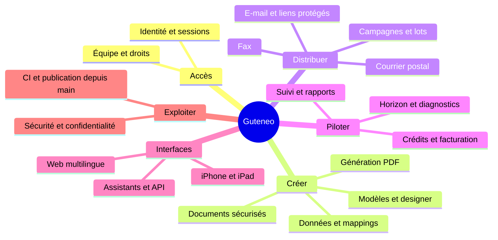

<!-- Generated from feature-map.json by node docs/build-feature-map.mjs -->
# Guteneo · atlas technique

> **19 domaines · 149 fonctionnalités · 20 parcours** — mis à jour le 2026-10-10.
> Documentation du dépôt uniquement. Implémentation ≠ activation ≠ preuve de publication.

Vue visuelle hors ligne : ouvrir [FEATURE_MAP.html](FEATURE_MAP.html) dans un navigateur. Source éditable : [feature-map.json](feature-map.json). Régénérer avec `node docs/build-feature-map.mjs`.

## Vue d’ensemble

## Droits en un coup d’œil

Le contrat définit quatre rôles humains. La cinquième colonne décrit l’assistant connecté, un acteur OAuth, sans ajouter de rôle de membership.

| Capacité | Administrateur | Superviseur | Opérateur | Observateur | Assistant connecté |
| --- | --- | --- | --- | --- | --- |
| Lire contenus accessibles | Oui | Oui | Oui | Oui | Selon membre + scopes |
| Contrôler à blanc un envoi existant | Selon accès à l’envoi | Selon accès à l’envoi | Selon accès à l’envoi | Selon accès à l’envoi | Membre + dispatches:read + accès à l’envoi ; aucune approbation |
| Importer / préparer | Oui | Oui | Oui | Non | Selon membre + scopes |
| Approuver / confirmer / annuler | Oui | Option Approbation | Non | Non | Mandat expert distinct uniquement |
| Rapports agrégés | Oui | Option Rapports | Non | Non | Selon membre + scopes |
| Gérer atelier / membres | Oui | Non | Non | Non | Non |
| Gérer facturation / souscrire Horizon | Navigateur ; consentement pour souscrire | Non | Non | Non | Non |
| Déclencher un diagnostic Horizon | Plan actif + accès PDF | Plan actif + accès PDF | Plan actif + accès PDF | Non | Plan actif + accès PDF + documents:write ; clé métier conservée |
| Lire / exporter l’historique Horizon | Selon accès PDF | Selon accès PDF | Selon accès PDF | Selon accès PDF | Accès PDF + documents:read |
| Accorder / renouveler mandat expert | Navigateur | Non | Non | Non | Non |
| Modifier modèle partagé | Droits sur ressource | Droits sur ressource | Droits sur ressource | Non | Membre + scopes + ressource ; confirmation hôte pour écrasement |
| Archiver modèle | Droit publier sur ressource | Droit publier sur ressource | Droit publier sur ressource | Non | Membre + templates:publish + ressource ; effet destructif signalé |
| Modifier partage du modèle | Droit partager sur ressource | Droit partager sur ressource | Droit partager sur ressource | Non | Membre + templates:share + ressource ; révocation signalée |
| Annuler génération | Propriétaire du lot | Propriétaire du lot | Propriétaire du lot | Non | Propriétaire + generations:write ; annulation signalée |
| Supprimer modèle | Propriétaire | Propriétaire | Propriétaire | Non | Propriétaire + scopes |
| Voir PDF généré privé | Créateur seulement | Créateur seulement | Créateur seulement | Selon accès autorisé | Selon propriétaire et contexte |
| Profil / langue / ses sessions | Personnel | Personnel | Personnel | Personnel | Pas d’administration navigateur |
| Lire profil et contacts de son atelier | Navigateur | Navigateur | Navigateur | Navigateur | Non |
| Modifier son nom et sa langue | Navigateur | Navigateur | Navigateur | Navigateur | Non |
| Ouvrir Belvédère global | Aucun droit par rôle atelier | Aucun droit par rôle atelier | Aucun droit par rôle atelier | Aucun droit par rôle atelier | Non |
| Lire le moniteur public local | Anonyme, aucun droit acquis | Anonyme, aucun droit acquis | Anonyme, aucun droit acquis | Anonyme, aucun droit acquis | Lectures publiques seulement |
| Lire le statut hébergé et son historique | Anonyme, aucun droit acquis | Anonyme, aucun droit acquis | Anonyme, aucun droit acquis | Anonyme, aucun droit acquis | Lectures publiques seulement |

Les deux options du superviseur sont indépendantes et fermées par défaut. Le rôle appartient à un atelier ; changer de rôle révoque les accès et les approbations encore en attente. Les scopes OAuth n’élèvent jamais les droits. La lecture de l’atelier n’ouvre pas les données ou PDF privés d’un autre créateur. Une demande liée peut donner une revue bornée aux approbateurs actuels ; elle n’ouvre pas la bibliothèque privée. Voir [le contrat des rôles](WORKSPACE_ROLES.md) et [le contrat du studio](TEMPLATES_DATA_DISTRIBUTION.md).

## Arbre exhaustif des fonctionnalités

### 01 · Accès et identité

**État :** Implémenté · disponibilité à vérifier.

Contrat : [ACCOUNT_IDENTITY.md](ACCOUNT_IDENTITY.md) · Source : [apps/api/src/auth.ts](../apps/api/src/auth.ts).

**Surfaces :** Web navigateur ; contrats natifs existants préservés ; pas de nouveau droit REST/MCP. **Tests :** [tests/unit/auth.test.ts](../tests/unit/auth.test.ts), [tests/unit/account.test.ts](../tests/unit/account.test.ts), [tests/e2e/account-identity.spec.ts](../tests/e2e/account-identity.spec.ts).

- Connexion Auth0, compte vérifié et politique MFA
- Connexion navigateur et callback Auth0 sur guteneo.com uniquement ; ancien hôte applicatif et previews URL fermés
- Création d’atelier et administrateur initial
- Profil personnel et préférence de langue
- Sessions web : consultation, révocation et déconnexion
- Changement d’atelier avec droits courants
- Connexions OAuth : rattachement, révocation et scopes
- Demande de suppression du compte ; traitement complet restant à qualifier
- Compte connecté visible : nom, adresse de connexion et rôle courant sur desktop et mobile
- Changement de compte explicite via réauthentification Auth0 sans supprimer le SSO habituel
- Retour d’onglet : identité et atelier réconciliés, choix explicite de langue conservé si la préférence serveur reste inchangée

### 02 · Équipe et responsabilités

**État :** Implémenté · disponibilité à vérifier.

Contrat : [WORKSPACE_ROLES.md](WORKSPACE_ROLES.md) · Source : [packages/contracts/src/roles.ts](../packages/contracts/src/roles.ts).

**Surfaces :** Navigateur authentifié. **Tests :** [tests/integration/workspace-roles.test.ts](../tests/integration/workspace-roles.test.ts), [tests/unit/account.test.ts](../tests/unit/account.test.ts), [tests/e2e/account-identity.spec.ts](../tests/e2e/account-identity.spec.ts).

- Quatre rôles humains et options indépendantes du superviseur
- Gestion des membres, changement de droits et révocation atomique
- Protection du dernier administrateur
- Invitation individuelle ou CSV ; aperçu et confirmation du lot
- Acceptation à adresse vérifiée, expiration et révocation des invitations
- Contacts navigateur des responsables de l’atelier, bornés et filtrés sur la membership courante
- Adresses de connexion pour distinguer les membres homonymes ; droits effectifs lisibles

### 03 · Documents et sécurité

**État :** Implémenté · disponibilité à vérifier.

Contrat : [SCANNER_RESCAN.md](SCANNER_RESCAN.md) · Source : [apps/api/src/documents.ts](../apps/api/src/documents.ts).

**Surfaces :** Web / REST / MCP. **Tests :** [tests/integration/documents.test.ts](../tests/integration/documents.test.ts).

- Dépôt PDF et import distant borné
- Recherche, liste paginée, lecture des métadonnées et pages
- Quarantaine, antivirus réel, empreinte et validation PDF
- Reprise d’analyse du même document, sans réimport
- Préchauffage scanner par administrateur navigateur
- Rendu HTML en PDF isolé et document immuable
- Stockage privé, quotas, rétention et confidentialité par propriétaire

### 04 · Studio de modèles

**État :** Implémenté · disponibilité à vérifier.

Contrat : [TEMPLATES_DATA_DISTRIBUTION.md](TEMPLATES_DATA_DISTRIBUTION.md) · Source : [apps/api/src/template-workflow.ts](../apps/api/src/template-workflow.ts).

**Surfaces :** Web / REST / MCP. **Tests :** [tests/unit/template-authoring.test.ts](../tests/unit/template-authoring.test.ts).

- Bibliothèque privée, partagée ou organisation
- Cinq exemples : lettre, facture, relevé, devis, livraison
- Copie privée ou création vierge ; guide de création REST/MCP
- Import Word DOCX et avertissements
- Designer : variables, tableaux, colonnes, logo, formats et conditions
- Schéma métier, jeux d’essai, calculs et totaux
- Suggestions IA revues puis appliquées explicitement
- Aperçu PDF exact, versions, publication, duplication et archivage
- Partage : utilisation, édition, publication et partage indépendants
- Suppression par propriétaire ; conservation des PDF et de la provenance

### 05 · Données et mappings

**État :** Implémenté · disponibilité à vérifier.

Contrat : [DATA_IMPORT.md](DATA_IMPORT.md) · Source : [apps/api/src/template-workflow.ts](../apps/api/src/template-workflow.ts).

**Surfaces :** Web / REST / MCP. **Tests :** [tests/unit/datasets.test.ts](../tests/unit/datasets.test.ts).

- Import CSV, XLSX, XML et JSON ; original privé
- Choix des feuilles, en-têtes ou chemin de records XML
- Profilage, anomalies et lecture paginée
- Reprise de l’analyse du même original
- Mapping versionné : champs, regroupements et jointures
- Validation du mapping avant génération
- Analyse IA facultative ; politique et transfert autorisés par administrateur navigateur

### 06 · Génération et distribution

**État :** Implémenté · disponibilité à vérifier.

Contrat : [TEMPLATES_DATA_DISTRIBUTION.md](TEMPLATES_DATA_DISTRIBUTION.md) · Source : [apps/api/src/template-workflow-routes.ts](../apps/api/src/template-workflow-routes.ts).

**Surfaces :** Web / REST / MCP. **Tests :** [tests/e2e/template-distribution.spec.ts](../tests/e2e/template-distribution.spec.ts).

- PDF unitaire depuis formulaire métier
- Lot de PDF depuis mapping validé
- Progression, résultats par record et provenance des cellules
- Annulation de génération et reprise des seuls records échoués
- Sélection des PDF et préparation d’un plan de distribution
- Destinataire commun ou colonnes figées ; canal explicite par record
- Reprise des entrées restantes sans duplication
- Contrôle postal lié à l’entrée ; revue et envoi séparés

### 07 · Fax

**État :** Implémenté · disponibilité à vérifier.

Contrat : [LIVE_FAX_QUOTES.md](LIVE_FAX_QUOTES.md) · Source : [packages/domain/src/index.ts](../packages/domain/src/index.ts).

**Surfaces :** Web / REST / MCP. **Tests :** [tests/e2e/fax-pricing.spec.ts](../tests/e2e/fax-pricing.spec.ts).

- PDF exact, numéro et expéditeur qualifié
- Devis fournisseur daté et renouvellement borné
- Fourchette estimée, plafond approuvé et crédits en euros
- Préparation, revue humaine, approbation et confirmation
- Suivi, reçus, règlement et issue inconnue
- Mode reviewer non envoyable : arrêt avant approbation

### 08 · Courrier postal

**État :** Implémenté · disponibilité à vérifier.

Contrat : [MCP_POSTAL_JOURNEY.md](MCP_POSTAL_JOURNEY.md) · Source : [apps/api/src/postal.ts](../apps/api/src/postal.ts).

**Surfaces :** Web / REST / MCP. **Tests :** [tests/e2e/postal-final-send.spec.ts](../tests/e2e/postal-final-send.spec.ts).

- Expéditeur, adresse, pays et exigences du fournisseur
- Fenêtre gauche/droite et page d’adresse explicite
- Options papier, couleur, recto/verso et service
- Contrôle PDF, rendu d’adresse et revue
- Autorisation distincte du transfert du PDF pour devis
- Devis exact, expiration et revue finale
- Confirmation, coupures calendaires et suivi fournisseur
- Projection des statuts et rapprochement des issues inconnues

### 09 · E-mail et liens protégés

**État :** Implémenté · disponibilité à vérifier.

Contrat : [PROTECTED_EMAIL.md](PROTECTED_EMAIL.md) · Source : [apps/api/src/protected-documents.ts](../apps/api/src/protected-documents.ts).

**Surfaces :** Web / REST / MCP. **Tests :** [tests/integration/protected-documents.test.ts](../tests/integration/protected-documents.test.ts).

- Message texte/HTML sans fichier, avec PDF ou lien protégé
- Attestation du destinataire et exigences transactionnelles
- Devis et supplément d’hébergement explicités
- Lien privé, expiration et mot de passe saisi dans le navigateur
- Téléchargement sans compte destinataire et contrôles d’accès
- Préparation, approbation, suivi et politique fournisseur
- Resend/SES : disponibilité contrôlée, activation séparée

### 10 · Contrôle à blanc des envois

**État :** Publié le 10 octobre dans c953596 ; refus anonyme 401/no-store vérifié ; parcours authentifié non qualifié en production.

Contrat : [PRODUCTION_DRY_RUN.md](PRODUCTION_DRY_RUN.md) · Source : [packages/domain/src/index.ts](../packages/domain/src/index.ts).

**Surfaces :** REST / MCP / CLI ; aucun nouveau bouton web, écran natif ou route mobile dédiée. **Tests :** [tests/integration/dispatch-validation.test.ts](../tests/integration/dispatch-validation.test.ts), [tests/unit/mcp-dispatch-validation.test.ts](../tests/unit/mcp-dispatch-validation.test.ts), [tests/unit/production-dry-run.test.ts](../tests/unit/production-dry-run.test.ts).

- Validation d’un envoi existant, limitée à l’atelier authentifié et à l’accès documentaire courant
- Lecture des gardes de préparation, absence de tentative, devis et restrictions applicables au canal
- Résultat partiel ou bloqué ; acceptation et livraison toujours non exécutées, simulation distincte de la production
- Aucun devis créé, renouvelé ou consommé ; expiration conservée ; aucune approbation, réservation, outbox ou tentative fournisseur
- Automatisable via REST GET ou MCP avec dispatches:read ; aucune autorité de préparation ou d’approbation ajoutée
- Lecture seule métier ; compteurs HTTP et observabilité MCP distincts, annotations de lecture observée conservées
- Runner test:prod:dry-run : 1–10 envois existants, GET séquentiels canonique, jeton de lecture injecté, preuve récente expurgée ; résultat toujours partiel

### 11 · Campagnes et supervision

**État :** Implémenté · disponibilité à vérifier.

Contrat : [API_CONTRACT.md](API_CONTRACT.md) · Source : [apps/api/src/index.ts](../apps/api/src/index.ts).

**Surfaces :** Web / REST / MCP. **Tests :** [tests/integration/domain-invariants.test.ts](../tests/integration/domain-invariants.test.ts).

- Campagne nommée et destinataires CSV
- Validation des lignes, erreurs et doublons
- Préparation d’envois avec le document sélectionné
- Liste et détail des envois, prix et statuts
- Rapports agrégés et consommation selon droits
- Annulation admissible et revue des opérations incertaines
- Administration des canaux et plafonds sans relance aveugle

### 12 · Crédits et facturation

**État :** Implémenté · disponibilité à vérifier.

Contrat : [WELCOME_CREDIT.md](WELCOME_CREDIT.md) · Source : [apps/api/src/billing.ts](../apps/api/src/billing.ts).

**Surfaces :** Navigateur authentifié. **Tests :** [tests/unit/billing.test.ts](../tests/unit/billing.test.ts).

- Solde de bienvenue commun en euros et attribution unique
- Disponible, réservé et consommé ; absence de recharge qualifiée
- Réservation atomique avec acceptation et outbox
- Règlement fournisseur et réserves sur issues inconnues
- Consultation administrative des crédits et facturation
- Connecteur Stripe préparé ; qualification commerciale séparée

### 13 · Assistants et API

**État :** Implémenté · métadonnées du 4 octobre à publier et rescanner ; autorisations serveur inchangées.

Contrat : [LLM_SETUP.md](LLM_SETUP.md) · Source : [apps/api/src/mcp.ts](../apps/api/src/mcp.ts).

**Surfaces :** Web / REST / MCP. **Tests :** [tests/unit/mcp-integrations.test.ts](../tests/unit/mcp-integrations.test.ts), [tests/integration/template-workflow.test.ts](../tests/integration/template-workflow.test.ts), [tests/unit/pdf-validation.test.ts](../tests/unit/pdf-validation.test.ts).

- Découverte des capacités et limites du compte
- Catalogue REST/OpenAPI et MCP Streamable HTTP
- Guides ChatGPT, Claude, Copilot et Cursor
- Import adapté au transport fichier effectivement disponible
- Documents, modèles, données, génération et préparation via outils
- Revue navigateur avant envoi ; scopes sans élévation de rôle
- Délégation experte bornée à un client OAuth, optionnelle
- Mandat accordé/révoqué par administrateur navigateur seulement
- Paquets plugin et dossier marketplace ; soumission distincte
- Annotations MCP explicites : écrasement, archivage, révocation de partage et annulation de génération signalés à l’hôte ; diagnostic non idempotent pour l’activité de connexion

### 14 · Compagnon iPhone et iPad

**État :** Implémenté · disponibilité à vérifier.

Contrat : [IOS_API.md](IOS_API.md) · Source : [apps/api/src/mobile.ts](../apps/api/src/mobile.ts).

**Surfaces :** iOS / API mobile / revue navigateur. **Tests :** [tests/e2e/mobile-account.spec.ts](../tests/e2e/mobile-account.spec.ts).

- Authentification système et sessions mobiles dédiées
- Navigation adaptative iPhone/iPad et accessibilité
- Profil, langue et demande de suppression du compte
- Import, inspection et recherche PDF
- Préparation fax/e-mail et suivi
- Revue finale dans navigateur authentifié ; pas de consentement natif
- Signature, appareil physique, TestFlight et App Store à qualifier

### 15 · Expérience publique et langues

**État :** Implémenté · disponibilité à vérifier.

Contrat : [MULTILINGUAL.md](MULTILINGUAL.md) · Source : [packages/contracts/src/public-site.json](../packages/contracts/src/public-site.json).

**Surfaces :** Web public / maquette. **Tests :** [tests/e2e/locale-boundaries.spec.ts](../tests/e2e/locale-boundaries.spec.ts), [tests/preview-e2e/language-navigation.spec.ts](../tests/preview-e2e/language-navigation.spec.ts).

- Présentation, fonctionnalités, rôles et guides assistants
- Journal, articles, notices légales et confidentialité
- Français, anglais, allemand et luxembourgeois
- Préférence personnelle et choix anonyme
- Douze films localisés, affiches, sous-titres et durées réelles
- Pages statiques, canonical, sitemap et langues alternatives
- Maquette publique fictive isolée du backend
- Cartes de partage multilingues et boutons lecture : intégrés à main par PR #43

### 16 · Horizon et diagnostic PDF

**État :** Ouverture sur crédits autorisée · qualification hébergée et activation à confirmer.

Contrat : [PDF_ACCESSIBILITY.md](PDF_ACCESSIBILITY.md) · Source : [apps/api/src/pdf-validation.ts](../apps/api/src/pdf-validation.ts).

**Surfaces :** Web / REST / MCP. **Tests :** [tests/unit/monthly-plan.test.ts](../tests/unit/monthly-plan.test.ts), [tests/e2e/horizon-pdf.spec.ts](../tests/e2e/horizon-pdf.spec.ts), [tests/unit/pdf-validation.test.ts](../tests/unit/pdf-validation.test.ts), [tests/preview-e2e/geo.spec.ts](../tests/preview-e2e/geo.spec.ts), [tests/preview-e2e/seo.spec.ts](../tests/preview-e2e/seo.spec.ts), [tests/unit/live-capabilities.test.ts](../tests/unit/live-capabilities.test.ts), [apps/pdf-validator/tests/qualification.test.mjs](../apps/pdf-validator/tests/qualification.test.mjs), [apps/pdf-validator/tests/container-lifecycle.test.mjs](../apps/pdf-validator/tests/container-lifecycle.test.mjs), [apps/pdf-validator/tests/worker.test.mjs](../apps/pdf-validator/tests/worker.test.mjs), [apps/pdf-validator/tests/test_server.py](../apps/pdf-validator/tests/test_server.py).

- Formule mensuelle 30 € sur crédits disponibles ; première période finançable par crédits promotionnels restants ; entrée privée /app/plan
- Consentement récurrent immutable par administrateur navigateur
- Résiliation, renouvellement et suspension sans dette ; recharge encore indisponible
- 100 tentatives par mois calendaire ; quota atomique
- veraPDF privé épinglé : PDF/UA-1/-2 et PDF/A-1b/2b/3b/4 ; corpus officiel positif/négatif, qualification hors réseau puis hébergée
- Rapport sur octets exacts, historique et export JSON
- Diagnostic via web/MCP et revue humaine obligatoire ; reprise explicite d’une issue réseau incertaine avec la même clé, contrôle indépendant avec une nouvelle clé
- Disponibilité publique et serveur partagent HORIZON_ENABLED, validateur privé et scanner en production ; lecture publique unique ; ouverture après qualification hébergée ; pas une certification légale

### 17 · Exploitation et fiabilité

**État :** Implémenté · disponibilité à vérifier.

Contrat : [PRODUCTION_REVIEW_2026_10_09.md](PRODUCTION_REVIEW_2026_10_09.md) · Source : [scripts/deploy-public.mjs](../scripts/deploy-public.mjs).

**Surfaces :** CLI / CI / services privés ; vue locale anonyme sans droit supplémentaire web/native/REST/MCP. **Tests :** [tests/security/main-only-release.test.mjs](../tests/security/main-only-release.test.mjs), [tests/security/pdf-validator-release.test.mjs](../tests/security/pdf-validator-release.test.mjs), [apps/pdf-validator/tests/probe-credentials.test.mjs](../apps/pdf-validator/tests/probe-credentials.test.mjs), [tests/security/production-monitor.test.mjs](../tests/security/production-monitor.test.mjs), [tests/security/observability.test.mjs](../tests/security/observability.test.mjs), [tests/integration/documents.test.ts](../tests/integration/documents.test.ts), [tests/unit/telnyx-readiness.test.ts](../tests/unit/telnyx-readiness.test.ts).

- Files interactives, lots, outbox transactionnelle et idempotence
- Callbacks fournisseur authentifiés et journaux sans contenu sensible
- Inspection Telnyx opérateur privée en lecture seule : callbacks principal/secours projetés en statuts bornés et booléens de correspondance canonique, sans URL brute ni extraction des credentials ; état fournisseur frais à qualifier après publication
- Rapprochement, reprise bornée et files mortes
- Migrations D1 ordonnées, intégrité et bookmark de restauration
- Services privés scanner, renderer et validateur ; déploiement depuis main propre sans route publique ni observabilité ; pont de qualification local avec secret temporaire, refus Origin et aucun transfert du secret ; les opérateurs deploy-pdf-validator.mjs et qualify-hosted.mjs vérifient Horizon fermé uniquement sur guteneo.com
- Tests backend, sécurité, navigateurs et CI exhaustive ; validateur basic max. 1, veille 5 s, JVM qualifiée sur 100 pages / 9,887 Mio ; CPU local −47 %, coût par diagnostic et qualification hébergée distincts
- Publication depuis main propre, synchronisé et vérifié
- Manifestes de release, empreintes des assets et santé distante sur guteneo.com ; preuve distincte de fermeture de workers.dev et des previews URL applicatifs
- Moniteur local de production : lectures anonymes bornées sur le domaine canonique et contrôle de fermeture de l’ancien hôte, hashes de pages, refus des accès privés, état périmé après 120 s et qualification partielle par fonction ; aucun envoi ni tâche permanente
- Purge idempotente après retour du curseur : tombstone et audit de succès liés au tenant ; reprise après panne R2 ou audit sans recompter les purges terminées
- CI à checkout ciblé conservant toutes les suites et médias publiés ; archives de travail exclues des runners

### 18 · Belvédère et supervision plateforme

**État :** Intégré au candidat ; activation et publication non qualifiées.

Contrat : [BELVEDERE.md](BELVEDERE.md) · Source : [apps/api/src/belvedere.ts](../apps/api/src/belvedere.ts).

**Surfaces :** Navigateur Veilleur seulement ; aucune autorité atelier/native/OAuth/MCP supplémentaire. **Tests :** [tests/unit/belvedere.test.ts](../tests/unit/belvedere.test.ts), [tests/unit/auth-telemetry.test.ts](../tests/unit/auth-telemetry.test.ts), [tests/belvedere-e2e/control-tower.spec.ts](../tests/belvedere-e2e/control-tower.spec.ts), [tests/unit/belvedere-finance.test.ts](../tests/unit/belvedere-finance.test.ts).

- Autorité Veilleur privée et lecture seule : session/identité vérifiées, adresse serveur secrète, autorisation distincte des rôles atelier
- Sept vues : ateliers, membres, envois, connexions, finances et infrastructure avec vue d’ensemble
- Observation facultative des connexions par pays, déduplication bornée et nouvelles sessions après changement d’atelier ; rétention de 90 jours
- Crédits promotionnels, consommations des envois/hébergement/Horizon, encaissements et coûts fournisseurs distincts
- Connecteurs Cloudflare côté serveur avec états explicites, sans coût ni marge inventés
- Migration additive 0052 ; aperçu déterministe limité au loopback ; activation hébergée séparée

### 19 · État public du service

**État :** Publié le 10 octobre dans c953596 ; premier cron à 02:45:05.570 UTC, 14/14 contrôles publics réussis ; parcours métier distincts.

Contrat : [STATUS_SERVICE.md](STATUS_SERVICE.md) · Source : [apps/status/worker.ts](../apps/status/worker.ts).

**Surfaces :** Page publique autonome et GET anonymes /api/status, /api/history ; aucun droit atelier, nouvelle capacité REST/MCP métier ou interface native. **Tests :** [tests/integration/status-service.test.ts](../tests/integration/status-service.test.ts), [tests/security/status-release.test.mjs](../tests/security/status-release.test.mjs), [tests/security/test-offline.test.mjs](../tests/security/test-offline.test.mjs), [tests/status-e2e/status.spec.ts](../tests/status-e2e/status.spec.ts).

- Service indépendant status.guteneo.com : quatorze lectures anonymes bornées du domaine canonique, toutes les quinze minutes, sans bindings ni secret métier
- Historique D1 7/30/365 jours : disponibilité observée et couverture des créneaux distinctes, journées vides inconnues, aucune reconstitution antérieure
- État inconnu si absence, erreur ou preuve âgée de plus de trente minutes ; aucune lecture publique ne déclenche une collecte
- Vues Service, Vérifications et Exploitation : preuve, date, limites et action ; aucune donnée client ni identifiant de commande
- Qualification locale séparée : tests du vrai domaine et PDF locaux avec réseau externe interdit, fournisseurs finaux simulés, rapport expurgé horodaté
- Footer de marque et effets saisonniers décoratifs bornés, désactivables et respectant la réduction de mouvement
- Publication dédiée depuis main propre avec manifeste, contrôles de source et migrations D1 statut exclusivement

## Parcours clients et reprise sur erreur

### J01 · Découvrir puis entrer

**Acteur :** Visiteur → membre. **Branche :** INVITATIONS / IDENTITY.

Ouvrir guteneo.com → choisir la langue → consulter l’offre et les guides → se connecter avec identité vérifiée sur l’origine canonique → créer ou rejoindre un atelier → lire ses droits → vérifier nom/adresse/rôle dans la navigation → ouvrir le profil ou choisir Changer de compte si nécessaire.

**Blocage / reprise :** Ancien hôte applicatif workers.dev et previews URL fermés : utiliser guteneo.com. Invitation expirée ou adresse différente : refuser ; aucune création implicite d’autorité. Adresse indisponible : afficher explicitement ; changement de compte soumis au callback canonique signé et à la politique Auth0. Configuration et fixtures ne prouvent pas une connexion humaine réelle.

Référence : [ACCOUNT_IDENTITY.md](ACCOUNT_IDENTITY.md).

### J02 · Administrer une équipe

**Acteur :** Administrateur navigateur. **Branche :** ÉQUIPE.

Membres → inviter une personne ou prévisualiser le CSV → choisir rôle/options → confirmer le lot → suivre les invitations → modifier ou révoquer les accès. Les adresses distinguent les homonymes ; un membre sans gestion ouvre ses contacts de l’atelier.

**Blocage / reprise :** Préserver le dernier administrateur ; changement de droits déconnecte et invalide les approbations en attente.

Référence : [WORKSPACE_ROLES.md](WORKSPACE_ROLES.md).

### J03 · Préparer un fax

**Acteur :** Administrateur / superviseur / opérateur. **Branche :** DOCUMENTS → FAX.

Importer PDF → attendre ready → choisir destinataire/expéditeur → devis et plafond → préparer → passer à un approbateur habilité → confirmer → suivre le même envoi. Avant revue, une lecture REST/MCP facultative contrôle à blanc l’envoi existant et son devis, sans le renouveler.

**Blocage / reprise :** Quarantaine, devis expiré, canal fermé ou crédits insuffisants : corriger avant envoi ; outcome unknown : rapprocher. Le contrôle reste partiel ou bloqué et ne vaut ni approbation ni preuve de livraison.

Référence : [LIVE_FAX_QUOTES.md](LIVE_FAX_QUOTES.md).

### J04 · Envoyer un courrier postal

**Acteur :** Préparateur → approbateur. **Branche :** DOCUMENTS → POSTAL.

PDF → adresse et options/fenêtre → préflight → revue et autorisation distincte du transfert → devis exact → revue finale → confirmation → suivi. Après préparation, le contrôle à blanc REST/MCP relit l’envoi et le devis existants sans nouveau transfert Pingen.

**Blocage / reprise :** PDF inadmissible, adresse non validée ou transfert inconnu : conserver IDs, ne pas retransférer automatiquement. Le devis expire normalement ; ce contrôle ne crée ni transfert ni consentement et ne reprend aucune issue inconnue.

Référence : [POSTAL_STREAMLINED.md](POSTAL_STREAMLINED.md).

### J05 · Préparer un e-mail

**Acteur :** Préparateur → approbateur. **Branche :** E-MAIL.

Lire capacités → mode sans fichier/PDF/lien → destinataire, texte et options → devis → préparation → revue humaine → confirmation admissible → suivi. Le contrôle à blanc REST/MCP d’une demande existante relit le devis et les gardes applicables du destinataire et du lien protégé, sans envoi.

**Blocage / reprise :** Canal désactivé/non qualifié ou review_prepare_only : arrêt ; mot de passe exclusivement navigateur. Aucun devis renouvelé ou consommé ; acceptation et livraison restent non exécutées.

Référence : [PROTECTED_EMAIL.md](PROTECTED_EMAIL.md).

### J06 · Créer un modèle réutilisable

**Acteur :** Préparateur avec droits de ressource. **Branche :** MODÈLES.

Exemple/copie privée, page vierge ou DOCX → designer et schéma → données d’essai → aperçu PDF → publier une version → partager les droits précis.

**Blocage / reprise :** Révision concurrente : recharger ; suppression propriétaire seulement ; PDF antérieurs conservés. Via MCP, présenter écrasement du brouillon, archivage ou révocation de partage et respecter les confirmations hôte ; aucune permission élargie.

Référence : [TEMPLATES_DATA_DISTRIBUTION.md](TEMPLATES_DATA_DISTRIBUTION.md).

### J07 · Transformer des données en PDF

**Acteur :** Préparateur propriétaire des données. **Branche :** DONNÉES → GÉNÉRATION.

Import CSV/XLSX/XML/JSON → analyse et profil → choisir mapping → valider → générer → consulter résultats/provenance → reprendre les seuls records échoués.

**Blocage / reprise :** Original privé ; IA seulement sous politique autorisée ; PDF générés privés même face à un autre administrateur. Annulation explicite : arrêter le lot sans effacer ses PDF ; le même lot annulé ne se reprend pas. MCP signale cette annulation comme destructive.

Référence : [TEMPLATES_DATA_DISTRIBUTION.md](TEMPLATES_DATA_DISTRIBUTION.md).

### J08 · Distribuer un lot

**Acteur :** Préparateur → approbateur. **Branche :** DISTRIBUTION.

Sélectionner les PDF → figer destinations/options/canal → préparer le plan → traiter préflights postaux → revoir chaque demande → confirmer → suivre. Les demandes déjà préparées peuvent être contrôlées à blanc une par une via leur identifiant REST/MCP.

**Blocage / reprise :** Génération/préparation sans envoi ; reprise de préparation ne reconfirme pas un envoi accepté. Cette lecture n’exécute ni réservation ni outbox et ne qualifie pas le lot de bout en bout.

Référence : [TEMPLATES_DATA_DISTRIBUTION.md](TEMPLATES_DATA_DISTRIBUTION.md).

### J09 · Superviser et observer

**Acteur :** Superviseur habilité / observateur. **Branche :** SUIVI.

Liste des envois → détail, montants et statuts → approbation si option accordée → rapports si option accordée → signaler une issue incertaine. → consulter le profil et les contacts : administrateur pour droits/facturation, superviseur réellement habilité pour approbation. Tout lecteur d’un envoi accessible peut consulter son contrôle à blanc REST/MCP, y compris l’observateur.

**Blocage / reprise :** Observateur : lecture seule des contenus accessibles ; prix individuels visibles même sans rapports agrégés. Contacts absents ou erreur réseau : état explicite/relecture ; pas de rôle ni de consentement inventé. Une preuve partielle ne donne pas le droit d’approuver ; accès documentaire privé et autorité courante restent requis.

Référence : [WORKSPACE_ROLES.md](WORKSPACE_ROLES.md).

### J10 · Travailler avec un assistant

**Acteur :** Membre + client OAuth. **Branche :** MCP / REST.

Connecter le client → vérifier capacités/scopes → chercher/importer/créer → préparer → ouvrir la revue humaine → suivre les IDs et les nextActions. Les annotations signalent les effets destructifs à l’hôte, sans modifier les gardes serveur ni autoriser un envoi. Après préparation, dry_run_dispatch avec dispatches:read expose les gardes de l’envoi existant, sans renouveler son devis ni créer une approbation.

**Blocage / reprise :** Assistant sans consentement implicite ; délégation experte séparée, bornée, révocable et contrôlée côté serveur. Un scan ancien ne prouve pas les métadonnées actuelles ; publier puis rescanner le correctif. L’activité de connexion peut être enregistrée : annotations readOnlyHint/idempotentHint false, destructiveHint/openWorldHint false. Les preuves non exécutées restent explicites.

Référence : [LLM_SETUP.md](LLM_SETUP.md).

### J11 · Utiliser iPhone ou iPad

**Acteur :** Membre sur client natif. **Branche :** NATIF → NAVIGATEUR.

Connexion système → compte/langue → import ou lecture PDF → préparation fax/e-mail → revue navigateur → retour au suivi.

**Blocage / reprise :** Session native ne peut ni approuver ni envoyer ; suppression du compte est une demande, pas une preuve d’effacement.

Référence : [IOS_API.md](IOS_API.md).

### J12 · Gérer les crédits

**Acteur :** Administrateur navigateur. **Branche :** FACTURATION.

Lire solde disponible/réservé/consommé → préparer au plafond → confirmer avec réservation atomique → suivre règlement et consommation. Le contrôle à blanc d’un envoi existant ne réserve et ne consomme aucun crédit.

**Blocage / reprise :** Pas de recharge réputée disponible ; réserves protégées tant que l’issue fournisseur est inconnue. Il ne vérifie pas le solde ou les quotas disponibles et ne remplace pas la transaction d’acceptation.

Référence : [WELCOME_CREDIT.md](WELCOME_CREDIT.md).

### J13 · Diagnostiquer un PDF avec Horizon

**Acteur :** Administrateur navigateur pour abonnement ; administrateur, superviseur, opérateur ou assistant autorisé pour diagnostic ; lecteur autorisé du PDF pour historique. **Branche :** HORIZON · OUVERTURE SUR CRÉDITS.

Consulter la disponibilité réelle → lire prix et crédits restants → consentir au débit de 30 € et au renouvellement dans le navigateur administrateur → choisir PDF prêt/profil → lancer diagnostic → rapport/historique/export → revue humaine → gérer résiliation. L’historique reste consultable après expiration du forfait, selon l’accès courant au PDF.

**Blocage / reprise :** Disponibilité non confirmée ou configuration incomplète : aucune souscription ; crédit insuffisant : aucun débit et renouvellement suspendu sans dette ; bonus promotionnel unique, recharge indisponible ; issue réseau incertaine : aucune reprise automatique, même clé lors de la reprise explicite ; contrôle indépendant après succès : nouvelle clé ; 100 tentatives/mois. Le diagnostic MCP annonce idempotentHint=false pour l’activité de connexion ; sa clé conserve la non-duplication métier, sans nouveau débit implicite.

Référence : [PDF_ACCESSIBILITY.md](PDF_ACCESSIBILITY.md).

### J14 · Recevoir un PDF protégé

**Acteur :** Destinataire externe. **Branche :** RÉCEPTION.

Ouvrir le lien → saisir le mot de passe → télécharger le PDF dans la période autorisée.

**Blocage / reprise :** Lien expiré, révoqué ou mot de passe invalide : refuser ; le fichier téléchargé ne devient pas lui-même chiffré.

Référence : [PROTECTED_DOCUMENTS.md](PROTECTED_DOCUMENTS.md).

### J15 · Publier une évolution

**Acteur :** Développeur / opérateur de release. **Branche :** RELEASE.

Mettre à jour arbre, droits et parcours → tests/PR → merge → CI sur main → migrations/services qualifiés → deploy:live sur guteneo.com uniquement → vérifier manifeste, assets et santé canoniques → qualifier séparément la fermeture de workers.dev et des previews URL applicatifs. Inspection Telnyx privée : lire les statuts et correspondances canoniques des callbacks après publication, sans mutation fournisseur. Pour Horizon : qualifier avec un pont CLI local et un secret temporaire privé → arrêter le container → fermer les RPC → activer seulement après preuves hébergées.

**Blocage / reprise :** Authentification Cloudflare absente : bloquer publication ; commit testé et déployé doivent correspondre. Ancien hôte applicatif et previews URL ouverts : fermeture non qualifiée ; aucune comparaison d’assets attendue sur un hôte fermé. Pont Horizon : origine navigateur ou secret absent/faux refusés avant les bindings ; secret exclu des arguments, logs, preuves et appels distants ; supprimer le fichier local après qualification.

Référence : [MAIN_RELEASE.md](MAIN_RELEASE.md).

### J16 · Vérifier son compte et contacter un responsable

**Acteur :** Membre navigateur dans son atelier courant. **Branche :** IDENTITÉ → RESPONSABILITÉS.

Depuis guteneo.com, lire nom/adresse/rôle → profil → modifier nom/langue → consulter droits effectifs et contacts → ouvrir volontairement mailto ou changer de compte avec Auth0 et retour canonique.

**Blocage / reprise :** Email en lecture seule ; aucun auto-changement de rôle. Contacts limités à 50 et à l’atelier courant, hors demandeur. Aucun envoi automatique, aucun annuaire assistant ; erreur visible et reprise manuelle.

Référence : [ACCOUNT_IDENTITY.md](ACCOUNT_IDENTITY.md).

### J17 · Superviser la plateforme avec Belvédère

**Acteur :** Veilleur navigateur avec identité vérifiée explicitement autorisée. **Branche :** PLATEFORME PRIVÉE.

Ouvrir adresse privée → garde actuelle session/identité → vues globales en lecture seule → distinguer les modes et les sources financières → examiner mesures Cloudflare selon configuration.

**Blocage / reprise :** Autre identité, rôle atelier seul, assistant, adresse incorrecte ou configuration absente : refus sans divulgation. Migration 0052 et configuration privée requises ; aucune donnée fournisseur simulée présentée comme réelle.

Référence : [BELVEDERE.md](BELVEDERE.md).

### J18 · Vérifier la production sans envoyer

**Acteur :** Opérateur local ; lectures anonymes publiques, aucune autorité atelier ou Veilleur acquise. **Branche :** EXPLOITATION.

Lancer monitor:prod ou monitor:prod:live → contrôler source et 17 preuves publiques → distinguer fonctions désactivées/non testées → consulter les métriques privées avec son propre accès → arrêter le processus après revue.

**Blocage / reprise :** Réponse incohérente, absence de scanner/identité ou protection anonyme rompue : attention et sortie non nulle. État périmé après 120 secondes ; reprise bornée chaque minute. Aucune authentification synthétique, activation, délégation, communication ni facturation automatique. Les données métier privées ne sont pas lues ; les canaris distants restent une proposition séparée.

Référence : [PRODUCTION_REVIEW_2026_10_09.md](PRODUCTION_REVIEW_2026_10_09.md).

### J19 · Contrôler à blanc un envoi existant

**Acteur :** Lecteur actuel de l’envoi parmi les quatre rôles ; assistant OAuth avec dispatches:read. **Branche :** ENVOIS → VALIDATION SANS EXPÉDITION.

Sélectionner un envoi déjà préparé et accessible → GET /api/dispatches/:id/dry-run ou dry_run_dispatch → conserver heure, empreinte et mode → distinguer gardes validées, bloquées et non exécutées → relire le même identifiant si nécessaire, sans renouveler son devis. Automatisation possible : test:prod:dry-run sur 1–10 IDs choisis, jeton borné fourni par l’environnement et sortie expurgée ; aucun cron de dry-run créé.

**Blocage / reprise :** Accès atelier/document refusé : aucune preuve métier. Envoi déjà engagé, devis expiré ou révoqué, préparation réservée à la revue ou garde bloquante : arrêt explicite ; aucune correction ou relance automatique. Résultat global partial ou blocked, jamais preuve d’acceptation ou de livraison. Pas de nouveau bouton web/natif. Contrat déployé dans c953596 et refus anonyme vérifié ; parcours authentifié non qualifié en production, aucun dry-run authentifié exécuté et aucune livraison effectuée pour cette qualification.

Référence : [PRODUCTION_DRY_RUN.md](PRODUCTION_DRY_RUN.md).

### J20 · Consulter la situation et les preuves du service

**Acteur :** Client, équipe ou astreinte ; accès public anonyme sans privilège atelier. **Branche :** STATUT PUBLIC → PREUVES → EXPLOITATION.

Ouvrir status.guteneo.com depuis Guteneo → vérifier date et fraîcheur → lire la disponibilité observée sur 7/30/365 jours et sa couverture → consulter les fonctionnalités → ouvrir Vérifications pour distinguer production, qualification locale et preuves manquantes → consulter Exploitation pour la prochaine action.

**Blocage / reprise :** Mesure absente, ancienne ou illisible : état actuel inconnu. Jours sans mesure en gris ; aucune disponibilité extrapolée. Les tests locaux ne deviennent pas une preuve de livraison. Les lectures n’exécutent aucun scénario, ne consomment aucun devis et ne déclenchent aucun envoi. Publication et première collecte distante restent des preuves distinctes.

Référence : [STATUS_SERVICE.md](STATUS_SERVICE.md).

## Frontières d’activation et preuves

- Un merge ne prouve ni un déploiement ni l’ouverture d’un canal. Lire les capacités du compte, le manifeste public et la version distante.
- Les PR #38, #41, #43, #47 et #48 sont fusionnées dans main ; la publication c5cc0dd et les migrations 0050–0051 sont vérifiées. L’ouverture d’Horizon sur crédits est autorisée ; la qualification hébergée et la publication de son activation restent des preuves distinctes.
- Horizon requiert service privé qualifié, scanner et activation explicite. Souscription : administrateur navigateur, 30 € de crédits disponibles et consentement récurrent. Le bonus promotionnel est unique et la recharge indisponible. Diagnostic : droits, propriété, abonnement et quota courants. Voir [la décision d’ouverture](HORIZON_OPENING_2026_10_03.md).
- Invitations, e-mail, fournisseurs réels et IA ont leurs propres conditions. Ne pas activer ces services pour rendre une démonstration possible.
- Une simulation ne qualifie pas un envoi réel. Une issue inconnue exige un rapprochement ; pas de nouvelle tentative aveugle.
- Tests et qualification : [CI](CI.md), [TEST_RESULTS](TEST_RESULTS.md), [MAIN_RELEASE](MAIN_RELEASE.md). Les résultats datés restent historiques.

## Maintenance obligatoire

Chaque PR qui ajoute, modifie ou retire une fonction met à jour cet arbre, les droits et les parcours concernés dans le même changement. Décrire entrée, étapes, sortie, erreurs/reprise, canaux, données privées, activation et preuve de test. Ajouter un lien vers le contrat détaillé, le code et les tests pertinents. Régénérer Markdown et HTML, puis vérifier liens, mise en page et cohérence avec le code. La CI exécute node docs/build-feature-map.mjs --check : vues synchronisées, matrice cohérente, références existantes et parcours complets ; la revue contrôle la couverture sémantique. Aucun de ces fichiers n’est relié au build ou à la navigation du site officiel.
